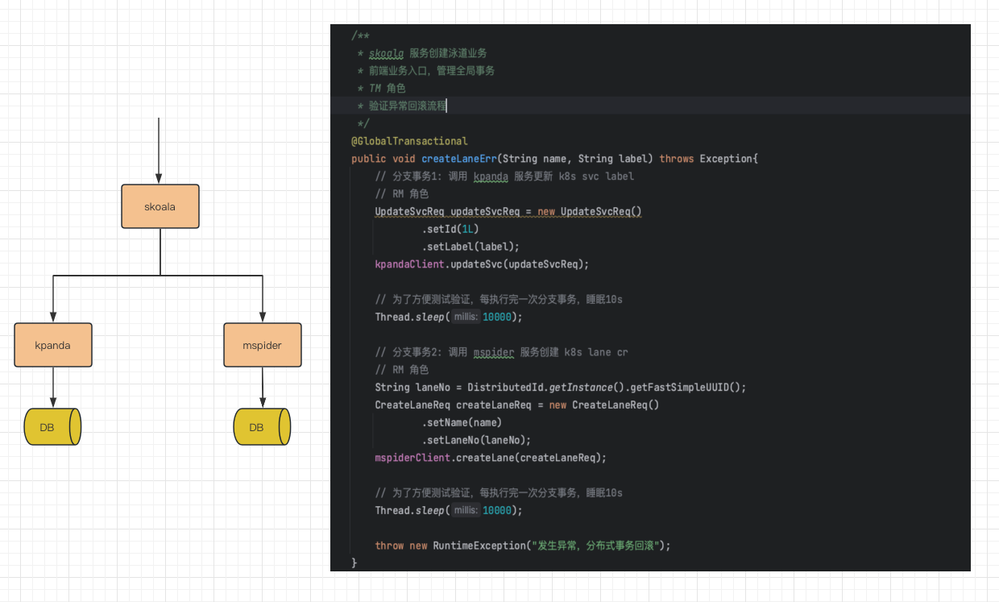
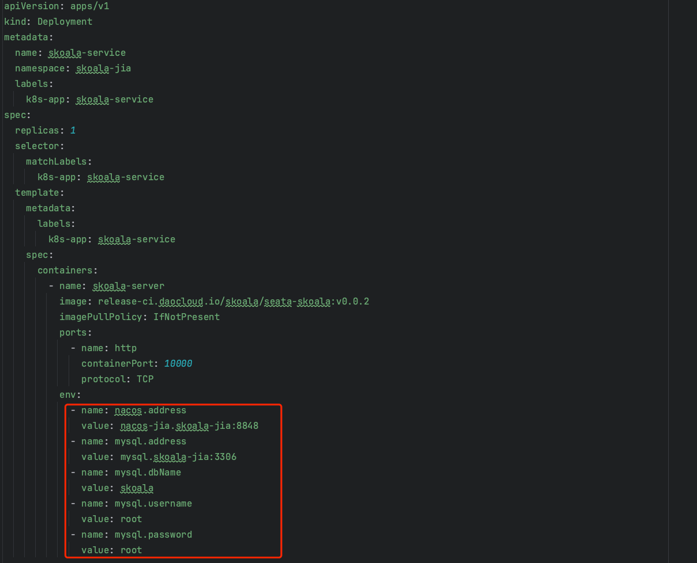

### 系统架构
该项目使用 seata AT 模式，系统架构如下图：

### 使用文档
1. 初始化 mysql 脚本，执行项目根目录 ddl.sql。
2. 更改项目根目录 k8s.yaml 里所有相关 deployment 环境变量配置，改为用户自己的 nacos 和 mysql 即可。如下图所示：

### 测试验证
注意：访问地址需换成实际部署后 skoala 服务的地址
```shell
# 访问 skoala 服务 api
# 为了方便测试验证，每执行完一次分支事务，睡眠10s
# 为了方便测试验证，该 api 共耗时 20s 左右
curl 'http://10.6.222.21:30096/lanes/err' \
--header 'Content-Type: application/json' \
--data '{
  "name" : "daocloud",
  "label" : "test123"
}'
```
### 接入文档
1. 引入 seata 相关依赖，如使用的 springcloud 框架可参考如下：

   ```xml
   <dependency>
     <groupId>io.seata</groupId>
     <artifactId>seata-spring-boot-starter</artifactId>
     <version>1.7.0</version>
   </dependency>
   <dependency>
     <groupId>com.alibaba.cloud</groupId>
     <artifactId>spring-cloud-starter-alibaba-seata</artifactId>
     <exclusions>
       <exclusion>
       <groupId>io.seata</groupId>
       <artifactId>seata-spring-boot-starter</artifactId>
       </exclusion>
     </exclusions>
   </dependency>
   ```

2. application.yml 里添加 seata 相关配置，可参考如下，实际场景根据需要自行定制。

   ```yaml
   seata:
     enable-auto-data-source-proxy: true
     data-source-proxy-mode: AT
     application-id: ${spring.application.name}
     tx-service-group: kpanda-service-group
     service:
       vgroupMapping:
         kpanda-service-group: default
       grouplist:
         default: localhost:8848
     registry:
       type: nacos
       nacos.:
         server-addr: ${nacos.address:localhost:8848}
         application: seata-server
         group: SEATA_GROUP
         namespace:
     config:
       type: nacos
       nacos.:
         server-addr: ${nacos.address:localhost:8848}
         group: SEATA_GROUP
         data-id: ${spring.application.name}-seata.properties
         namespace:
   ```

3. 根据 application.yml 里 seata.config 相关的配置，去 nacos 创建相关的配置，可参考如下。特别注意：service.default.grouplist=nacos-jia.skoala-jia，需改成当前使用的 nacos 地址。

   ```properties
   #For details about configuration items, see https://seata.io/zh-cn/docs/user/configurations.html
   #Transport configuration, for client and server
   transport.type=TCP
   transport.server=NIO
   transport.heartbeat=true
   transport.enableTmClientBatchSendRequest=false
   transport.enableRmClientBatchSendRequest=true
   transport.enableTcServerBatchSendResponse=false
   transport.rpcRmRequestTimeout=30000
   transport.rpcTmRequestTimeout=30000
   transport.rpcTcRequestTimeout=30000
   transport.threadFactory.bossThreadPrefix=NettyBoss
   transport.threadFactory.workerThreadPrefix=NettyServerNIOWorker
   transport.threadFactory.serverExecutorThreadPrefix=NettyServerBizHandler
   transport.threadFactory.shareBossWorker=false
   transport.threadFactory.clientSelectorThreadPrefix=NettyClientSelector
   transport.threadFactory.clientSelectorThreadSize=1
   transport.threadFactory.clientWorkerThreadPrefix=NettyClientWorkerThread
   transport.threadFactory.bossThreadSize=1
   transport.threadFactory.workerThreadSize=default
   transport.shutdown.wait=3
   transport.serialization=seata
   transport.compressor=none
   
   #Transaction routing rules configuration, only for the client
   service.vgroupMapping.skoala-service-group=default
   #If you use a registry, you can ignore it
   service.default.grouplist=nacos-jia.skoala-jia
   service.enableDegrade=false
   service.disableGlobalTransaction=false
   
   #Transaction rule configuration, only for the client
   client.rm.asyncCommitBufferLimit=10000
   client.rm.lock.retryInterval=10
   client.rm.lock.retryTimes=30
   client.rm.lock.retryPolicyBranchRollbackOnConflict=true
   client.rm.reportRetryCount=5
   client.rm.tableMetaCheckEnable=true
   client.rm.tableMetaCheckerInterval=60000
   client.rm.sqlParserType=druid
   client.rm.reportSuccessEnable=false
   client.rm.sagaBranchRegisterEnable=false
   client.rm.sagaJsonParser=fastjson
   client.rm.tccActionInterceptorOrder=-2147482648
   client.tm.commitRetryCount=5
   client.tm.rollbackRetryCount=5
   client.tm.defaultGlobalTransactionTimeout=60000
   client.tm.degradeCheck=false
   client.tm.degradeCheckAllowTimes=10
   client.tm.degradeCheckPeriod=2000
   client.tm.interceptorOrder=-2147482648
   client.undo.dataValidation=true
   client.undo.logSerialization=jackson
   client.undo.onlyCareUpdateColumns=true
   server.undo.logSaveDays=7
   server.undo.logDeletePeriod=86400000
   client.undo.logTable=undo_log
   client.undo.compress.enable=true
   client.undo.compress.type=zip
   client.undo.compress.threshold=64k
   #For TCC transaction mode
   tcc.fence.logTableName=tcc_fence_log
   tcc.fence.cleanPeriod=1h
   
   #Log rule configuration, for client and server
   log.exceptionRate=100
   
   ```
